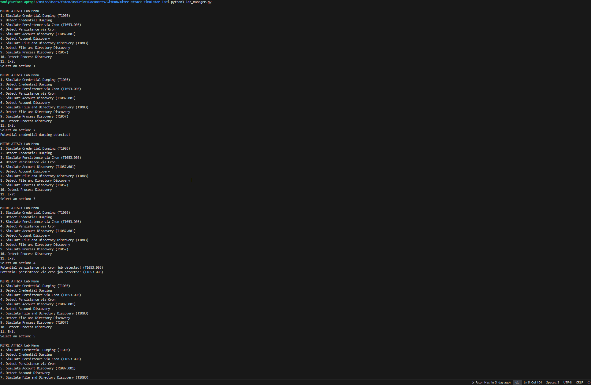

[](https://github.com/FatonHaxhiu/mitre-attack-simulator-lab/actions)
[](https://github.com/psf/black)
[](https://docs.pytest.org/)
[](https://www.python.org/)
[](https://www.docker.com/)
[](LICENSE)

# MITRE ATT&CK Simulator Lab

A hands-on lab for simulating and detecting MITRE ATT&CK techniques on Linux systems.  
A toolkit for simulating and detecting MITRE ATT&CK techniques for blue team practice and detection engineering.  
- **Easy to run** (supports Docker and Python)
- Includes simulation and detection scripts for multiple ATT&CK techniques.

---

## Features

- Simulates multiple MITRE ATT&CK techniques on Linux (expandable)
- Detection scripts for each simulated technique
- Simple command-line interface (CLI) for selecting simulations/detections
- Modular and easy to extend with new techniques
- Continuous integration (CI) with linting and runtime checks
- Added simulation & detection for T1059.001 (PowerShell Execution).

---

## Use Cases

- **Blue Team Training:** Practice detecting common attacker behaviors in a safe lab setting.
- **Detection Engineering:** Test and refine custom detection logic for various MITRE ATT&CK techniques.
- **Demo/Teaching:** Demonstrate how specific Linux-based attack techniques work and how to spot them.
- **CI/CD Security:** Ensure detection scripts and simulations remain functional as the project grows.


---

## Usage

1. **Clone the repository**
2. **Install dependencies:**  
   ```bash
   pip install -r requirements.txt
   ```
3. **Run the lab manager:**  
   ```bash
   python3 lab_manager.py
   ```

## Screenshot


---
## Running with Docker

You can run the MITRE ATT&CK Simulator Lab in a container without installing Python or dependencies on your machine:

```bash
# Build the Docker image
docker build -t mitre-attack-lab .

# Run the lab (interactive mode)
docker run -it mitre-attack-lab
```

- The CLI menu will appear inside the container.
- For advanced usage (mounting logs, custom scripts), see Docker documentation.
---

## Available Techniques

| #  | Technique Name                  | ATT&CK ID   | Simulator Script                       | Detector Script                       |
|----|---------------------------------|-------------|----------------------------------------|---------------------------------------|
| 1  | Credential Dumping              | T1003       | simulate_credential_dumping.py         | parse_sysmon_logs.py                  |
| 2  | Persistence via Cron            | T1053.003   | simulate_cron_persistence.py           | parse_cron_logs.py                    |
| 3  | Account Discovery               | T1087.001   | simulate_account_discovery.py          | parse_account_discovery_logs.py        |
| 4  | File & Directory Discovery      | T1083       | simulate_file_discovery.py             | parse_file_discovery_logs.py          |
| 5  | Process Discovery               | T1057       | simulate_process_discovery.py          | parse_process_discovery_logs.py       |

> **Note:** All scripts are in the `simulators/` and `detectors/` folders.

---

## Menu Options

The CLI menu (`lab_manager.py`) lets you:
- Run a technique simulation (writes logs as if an attack occurred)
- Run the detection script for that technique (parses logs and reports detection)

---

## How to Add a New Technique

1. Write a simulator script in `simulators/` (simulate the technique and log output)
2. Write a detection script in `detectors/` (detect the simulated activity)
3. Add menu options in `lab_manager.py` for your scripts
4. Update this README table

---

##  How to Contribute

Pull requests are welcome!  
Please run CI checks and follow PEP8 formatting (auto-format with [black](https://github.com/psf/black) or [autopep8](https://github.com/hhatto/autopep8)).
Want to add more MITRE ATT&CK techniques or improve detections?  
See [CONTRIBUTING.md](CONTRIBUTING.md) for guidelines!

---

## License

MIT License

---